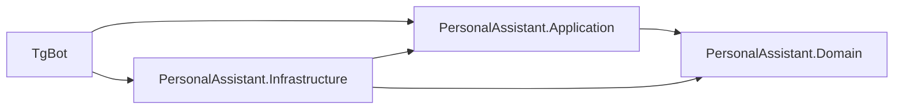

# Архитектура PersonalAssistant

## Обзор

Приложение разделено на Domain, Application, Infrastructure и Bot. Telegram является внешним адаптером, а бизнес-правила не зависят от него или PostgreSQL.

## Ответственность проектов

- `Domain`: `User`, `RecurringPayment`, `PaymentTransaction`, `Reminder`, `ConversationState`, перечисления и расчет следующей даты.
- `Application`: сценарии, DTO, валидация и интерфейсы хранилищ.
- `Infrastructure`: `DbContext`, PostgreSQL, миграции, Telegram-клиент, фоновые сервисы и UTC/time-zone адаптеры.
- `Bot`: конфигурация host, DI, команды, callback-кнопки и форматирование сообщений.

Регистрация и настройка профиля реализованы через `UserRegistrationService` и `UserTimeZoneService`; Telegram-обработчик только переводит Update в вызов application-сервиса.

## Связи данных

`User` 1:N `RecurringPayment`; `RecurringPayment` 1:N `PaymentTransaction`; `RecurringPayment` 1:N `Reminder`; `User` 1:1 `ConversationState`. Все запросы платежей включают владельца.

## Состояние диалога

Многошаговые сценарии хранятся в PostgreSQL как сериализованный JSON с версией и временем обновления. Это переживает перезапуск приложения и позволяет удалить просроченные состояния.

## Даты и часовые пояса

Дата, которую вводит пользователь для платежа, — `DateOnly`. Время создания, изменения и отправки напоминаний — UTC. При первом `/start` бот предлагает inline-кнопки часовых поясов и сохраняет выбранный IANA-идентификатор в `User.TimeZoneId`. `/settings` позволяет повторить выбор. Для ежедневной проверки фоновой службой UTC переводится в часовой пояс пользователя. Некорректный часовой пояс не сохраняется.

## Напоминания и идемпотентность

Фоновый `BackgroundService` выбирает активные платежи, вычисляет локальные даты и записывает уникальный ключ `(PaymentId, DueDate, ReminderKind, LocalDate)`. Повторный запуск не отправляет уже обработанное напоминание.

## Ошибки и логирование

Пользователю возвращается понятное сообщение, техническая причина пишется через `ILogger`. Токены, строки подключения и персональные платежные данные не попадают в логи.

## Тестирование

Доменная логика тестируется unit-тестами без БД и Telegram. Интеграционные тесты проверяют PostgreSQL и изоляцию владельцев.

## Известные ограничения MVP

Конвертация валют, банковские интеграции, веб-интерфейс, семейный доступ и автоматическое подтверждение списаний пока не реализуются.
