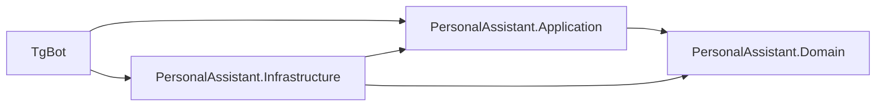

# Архитектура PersonalAssistant

## Обзор

Приложение разделено на Domain, Application, Infrastructure и Bot. Telegram является внешним адаптером, а бизнес-правила не зависят от него или PostgreSQL.

## Ответственность проектов

- `Domain`: `User`, `RecurringPayment`, `PaymentTransaction`, `Reminder`, `ConversationState`, перечисления и расчет следующей даты.
- `Application`: сценарии, DTO, валидация и интерфейсы хранилищ.
- `Infrastructure`: `DbContext`, PostgreSQL, миграции, Telegram-клиент, фоновые сервисы и UTC/time-zone адаптеры.
- `Bot`: конфигурация host, DI, команды, callback-кнопки и форматирование сообщений.

Регистрация и настройка профиля реализованы через `UserRegistrationService` и `UserTimeZoneService`; Telegram-обработчик только переводит Update в вызов application-сервиса.

Создание платежа реализовано через `PaymentConversationService`: каждый шаг сериализуется в `ConversationState.PayloadJson`, поэтому диалог не теряется после перезапуска. `PaymentService` создает платеж только с переданным `UserId`, а `PaymentRepository` фильтрует выборки по владельцу и активности.

Редактирование реализовано через `PaymentEditConversationService`: платеж выбирается callback-кнопкой, а изменения полей сохраняются в том же `ConversationState`. `PaymentService` получает платеж только через owner-scoped запрос, применяет доменный `UpdateDetails` и не затрагивает связанные транзакции. Отключение выполняется через `Deactivate` после отдельного подтверждения и оставляет запись платежа и его историю в базе.

Оплата реализована через `PaymentRecordConversationService`: пользователь выбирает активный платеж, подтверждает фактическую сумму и дату, после чего `PaymentService` вызывает доменное `RecordPayment`. Создается отдельный `PaymentTransaction` с фактической суммой, а у регулярного платежа рассчитывается следующий срок. Однократный платеж деактивируется после записи транзакции. История выбирается через owner-scoped запрос и не зависит от текущих параметров платежа.

Статистика строится в `PaymentService.GetMonthlyStatisticsAsync`: активные платежи разворачиваются в плановые вхождения внутри выбранного месяца, транзакции фильтруются по датам и владельцу, а итоговые суммы группируются по сохраненной валюте транзакции. Валюты не складываются между собой. Если после оплаты срок платежа уже сдвинут в следующий месяц, оплаченный срок восстанавливается в плановой части по `PaidPeriod`.

`PaymentTransaction` хранит снимки ожидаемой суммы и валюты на момент оплаты. Поэтому изменение текущей суммы или валюты платежа не переписывает историю и статистику прошлых месяцев.

## Связи данных

`User` 1:N `RecurringPayment`; `RecurringPayment` 1:N `PaymentTransaction`; `RecurringPayment` 1:N `Reminder`; `User` 1:1 `ConversationState`. Все запросы платежей включают владельца.

## Состояние диалога

Многошаговые сценарии хранятся в PostgreSQL как сериализованный JSON с версией и временем обновления. Это переживает перезапуск приложения и позволяет удалить просроченные состояния.

Запуск новой команды создания, редактирования или оплаты сбрасывает тип и payload существующего состояния. Финальное изменение платежа и удаление состояния сохраняются одним вызовом `SaveChanges`, что снижает риск повторной обработки после сбоя.

После успешного сохранения оплаты состояние диалога удаляется только после записи транзакции и обновления регулярного платежа. Telegram-слой возвращает главное меню после завершения или отмены сценария, чтобы временные кнопки не оставались активными.

Для транзакций действует уникальность `(RecurringPaymentId, PaidPeriod)`. Перед записью сервис проверяет существующую оплату, а конфликт конкурентной записи преобразуется в безопасный результат сценария вместо необработанного исключения.

## Даты и часовые пояса

Дата, которую вводит пользователь для платежа, — `DateOnly`. Время создания, изменения и отправки напоминаний — UTC. При первом `/start` бот предлагает inline-кнопки часовых поясов с UTC-смещением и сохраняет выбранный IANA-идентификатор в `User.TimeZoneId`. `/settings` позволяет повторить выбор, изменить валюту по умолчанию и число дней до напоминания. Дата «сегодня» вычисляется в часовом поясе пользователя. Некорректный часовой пояс не сохраняется.

## Напоминания и идемпотентность

Фоновый `BackgroundService` выбирает активные платежи, вычисляет локальные даты и записывает уникальный ключ `(PaymentId, DueDate, ReminderKind, LocalDate)`. Повторный запуск не отправляет уже обработанное напоминание.

## Ошибки и логирование

Пользователю возвращается понятное сообщение, техническая причина пишется через `ILogger`. Токены, строки подключения и персональные платежные данные не попадают в логи.

При старте приложение проверяет обязательную конфигурацию и автоматически применяет EF Core миграции до запуска Telegram polling. Для ограниченного запуска можно задать список разрешенных Telegram User ID через `Telegram:AllowedUserIds` или `TELEGRAM_ALLOWED_USER_IDS`.

## Тестирование

Доменная логика тестируется unit-тестами без БД и Telegram. Интеграционные тесты проверяют PostgreSQL и изоляцию владельцев.

## Известные ограничения MVP

Конвертация валют, банковские интеграции, веб-интерфейс, семейный доступ и автоматическое подтверждение списаний пока не реализуются.
